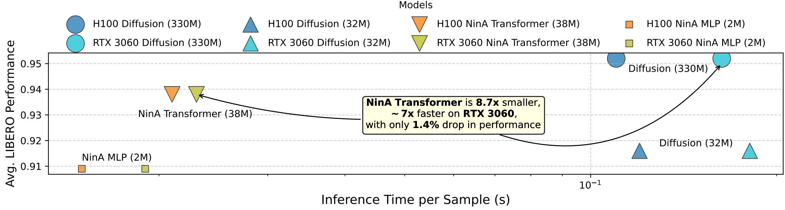
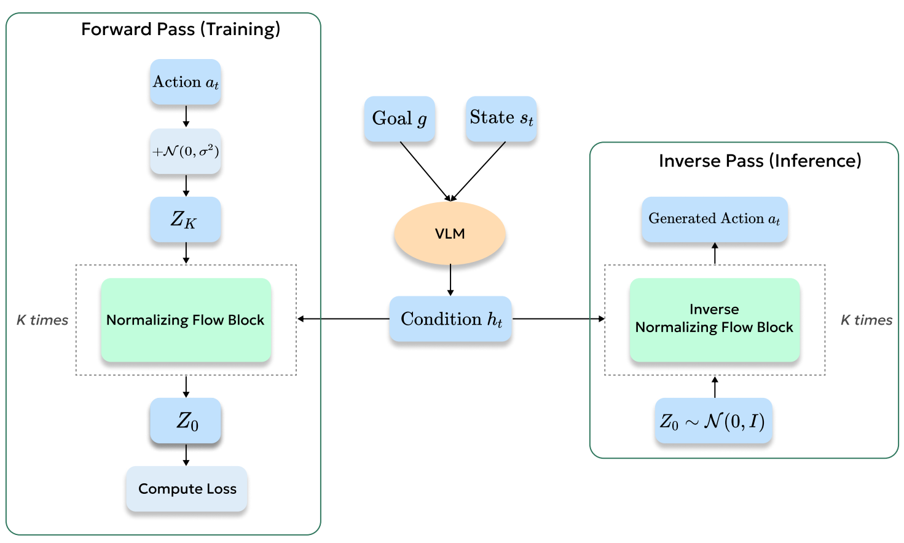
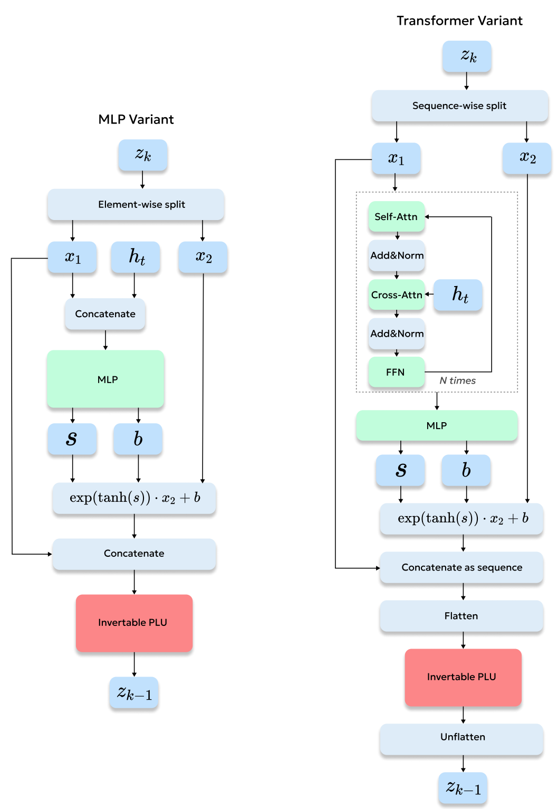

# NinA
[](https://arxiv.org/abs/2508.16845)

This repository builds on the [FLOWER VLA](https://github.com/intuitive-robots/flower_vla_calvin) codebase.  

**NinA** replaces the diffusion-based approach with **Normalizing Flows (NF)** for training VLA models.  
Our results show that NF achieves performance comparable to diffusion policies, while requiring significantly fewer parameters and offering faster inference.  



---

## Training Overview
NinA follows the standard NF training procedure, illustrated below:  



---

## NinA Variants
We provide two backbone architectures:  

- **MLP** – a lightweight and simple variant.  
- **Transformer** – a more scalable and performant option.  

The implementation can be found in [`flower/models/flower_nf.py`](flower/models/flower_nf.py).  



---

## Installation
Follow the installation instructions from the [FLOWER VLA repository](https://github.com/intuitive-robots/flower_vla_calvin) to set up this codebase.

---

## Training
To train the NinA, run:
```
python3 flower/training_libero.py 
```

### Important parameters
`--backbone`: backbone architecture (`mlp` or `trans`).

`--n_layers`: number of flow layers.

`--affine_dim`: hidden size of flow layers.

`--action_noise_mult`: amplitude of noise added to ground-truth actions (**important hyperparameter**).

`--use_plu`: whether to use PLU transformations (`true`/`false`). Our experiments show minimal impact of PLU on performance.  

## Citation
If you find this code useful, please cite our work:

```bibtex
@article{tarasov2025nina,
  title={NinA: Normalizing Flows in Action. Training VLA Models with Normalizing Flows},
  author={Tarasov, Denis and Nikulin, Alexander and Zisman, Ilya and Klepach, Albina and Lyubaykin, Nikita and Polubarov, Andrei and Derevyagin, Alexander and Kurenkov, Vladislav},
  journal={arXiv preprint arXiv:2508.16845},
  year={2025}
}
```

